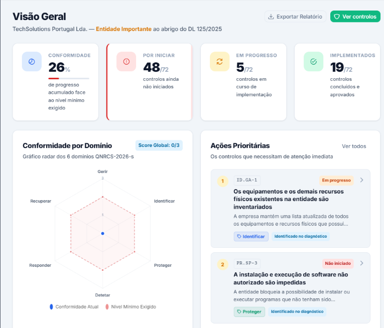
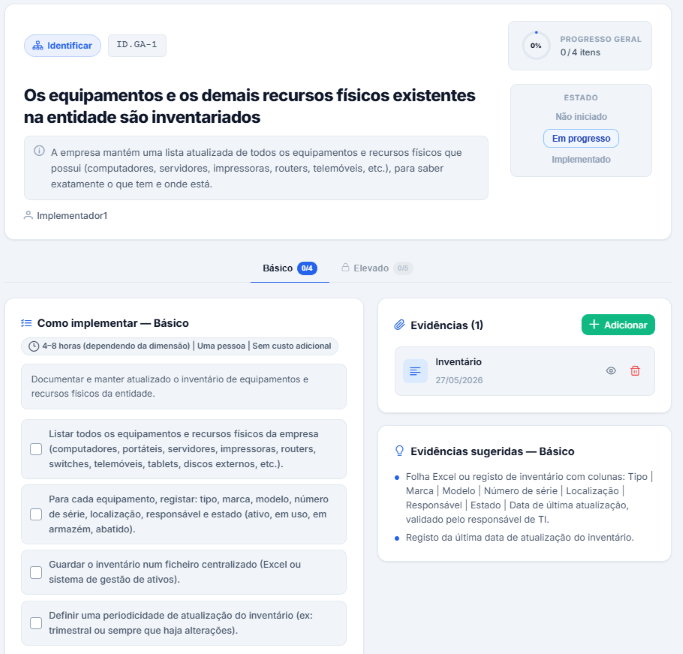

<div align="center">

# NIS2PME

**Cibersegurança NIS2 nas PME — Plataforma de Apoio à Autoavaliação e Conformidade**

[](LICENSE)
[](#estado-do-projeto)
[](https://fastapi.tiangolo.com)
[](https://vuejs.org)
[](https://www.postgresql.org)
[](https://www.docker.com)

[English](README.md) · **[Português 🇵🇹](README.pt-PT.md)**

</div>

---

## O que é o NIS2PME?

O **NIS2PME** é uma plataforma **SaaS multi-tenant de GRC** (*Governance, Risk & Compliance*) que ajuda as **PME portuguesas** a autoavaliar a conformidade com a **Diretiva NIS2** (transposta pelo *Regime Jurídico da Cibersegurança*, atualizado pelo *Decreto-Lei n.º 125/2025*) e o **QNRCS 2026** (Quadro Nacional de Referência para a Cibersegurança).

Assenta num **Universal Control Framework (UCF)** capaz de representar qualquer quadro normativo, aqui instanciado para os **107 controlos** do **QNRCS 2026**, conforme publicado no *Regulamento n.º 756/2026* (de 22 de junho de 2026).

A plataforma é oferecida num **modelo dual**:

- **Serviço gerido (SaaS)** — alojado e operado por nós.
- **Instalação local (on-premises)** — o núcleo open source, distribuído como imagens Docker sob a licença **AGPLv3**, que corre na tua própria infraestrutura.

Este repositório contém o **núcleo open source on-premises**.

---

## Conceitos-chave

| Conceito | O que faz |
|----------|-----------|
| **Universal Control Framework (UCF)** | Um modelo genérico que representa qualquer quadro normativo. Carregado aqui com os 107 controlos do QNRCS 2026; outros frameworks podem ser adicionados sem alterar código. |
| **Gated Maturity Model (GMM)** | A maturidade é desbloqueada nível a nível: o nível seguinte só abre quando os sub-requisitos do nível atual estão cumpridos, com uma **fórmula de conformidade ponderada**. |
| **Plano de ações prioritárias** | Gerado automaticamente, cruzando as vulnerabilidades mais comuns das PME com os controlos — indica **por onde começar**. |
| **Gestão de evidências** | Carrega e associa ficheiros de evidência cifrados a cada controlo, para suportar a autoavaliação. |

---

## Funcionalidades

- 📊 **Dashboard de maturidade** com gráficos radar e pontuação de conformidade ponderada
- 🧭 **Assistente de configuração guiado** que determina se és entidade *importante* ou *essencial*
- 🗂️ Armazenamento de **evidências cifradas** (Fernet) associadas aos controlos
- 📑 **Relatórios PDF** gerados no cliente
- 🔐 **Segurança forte**: hashing de passwords com Argon2id, autenticação JWT, **2FA/TOTP** e **registo de auditoria** completo
- 🌐 **Deploy autossuficiente**: PostgreSQL + FastAPI + nginx, com secrets gerados automaticamente no primeiro arranque

---

## Stack tecnológica

- **Backend:** FastAPI (Python), SQLAlchemy + migrações Alembic
- **Frontend:** Vue.js 3, PrimeVue, Pinia, Vite, Chart.js
- **Base de dados:** PostgreSQL 16
- **Segurança:** cifra Fernet, Argon2id, JWT, 2FA/TOTP
- **Distribuição:** imagens Docker publicadas no **GitHub Container Registry (GHCR)**

---

## Arranque rápido

> **Requisitos:** um servidor Linux (Ubuntu 20.04+, Debian 11+, RHEL/Rocky 8+, Fedora, etc.) com **Docker Engine 20.10+** e **Docker Compose v2**. Mínimo 2 vCPU / 2 GB RAM / 20 GB disco. Porta **80/TCP** (e **443/TCP** para HTTPS).

### Opção 1 — Instalação numa linha (mais fácil)

Para quem só quer pôr a funcionar. Descarrega o instalador, deteta automaticamente o IP do servidor, gera uma password segura para a base de dados, puxa as imagens do GHCR e arranca tudo:

```bash
curl -fsSL https://raw.githubusercontent.com/nis2pme/platform/main/start_nis2pme.sh | bash
```

> 🔎 **Dica de segurança:** enviar um script diretamente para o `bash` executa código remoto no teu servidor. Se preferires lê-lo primeiro (recomendado em qualquer máquina sensível):
> ```bash
> curl -fsSL https://raw.githubusercontent.com/nis2pme/platform/main/start_nis2pme.sh -o start_nis2pme.sh
> less start_nis2pme.sh        # inspecionar
> sh start_nis2pme.sh
> ```

No fim, abre no browser o URL que aparece (ex.: `https://192.168.1.50`) para correr o **assistente de configuração**.

> ℹ️ **O one-liner corre sem perguntas.** Ao ser enviado para o `bash` não tem terminal, por isso usa defaults: o menu de idioma é saltado (**Português**) e é gerado um **certificado temporário self-signed** (o browser avisa na 1.ª visita — é normal). Para escolheres o idioma e o modo TLS (certificado próprio / atrás de proxy / self-signed), descarrega e corre antes: `sh start_nis2pme.sh`. Podes sempre definir ou substituir o certificado mais tarde no assistente de configuração.

### Opção 2 — Docker Compose (um pouco mais de controlo)

Para quem percebe um pouco de Docker:

```bash
# 1. Obter o ficheiro compose
curl -fsSL https://raw.githubusercontent.com/nis2pme/platform/main/docker-compose.yml -o docker-compose.yml

# 2. Criar um .env mínimo
cat > .env <<'EOF'
APP_URL=https://IP_DO_TEU_SERVIDOR
DB_PASSWORD=mudar-para-uma-string-longa-aleatoria
TLS_MODE=self-signed
EOF

# 3. Arrancar (as imagens são puxadas do GHCR — sem build)
docker compose up -d
```

> O `TLS_MODE` pode ser `self-signed` (default — gera um certificado temporário), `custom` (o teu certificado + chave — ver [`.env.example`](.env.example)), ou `proxy` (TLS terminado a montante por Cloudflare/Traefik/Nginx; nesse caso usa `APP_URL=http://…`). A pasta `./certs` é criada automaticamente.

### Opção 3 — `docker run` manual / build a partir do código

Para utilizadores avançados. As imagens publicadas são:

```
ghcr.io/nis2pme/backend:latest
ghcr.io/nis2pme/frontend:latest
```

Para construíres as imagens tu próprio em vez de as puxar, vê o [CONTRIBUTING.md](CONTRIBUTING.md) e o `docker-compose.build.yml`.

---

## Primeiro acesso — Assistente de configuração

Após o arranque, abre o URL indicado. O assistente guia-te em 5 passos:

1. **Dados da empresa** — nome, sector, dimensão (micro/pequena/média). O sistema determina o nível de conformidade exigido (entidade importante vs. essencial).
2. **Conta de administrador** — nome, email e password do utilizador administrador principal.
3. **Email (SMTP)** (opcional) — envio de email para reposição de password; pode ser configurado mais tarde.
4. **HTTPS** — revisão do certificado TLS ativo e opção de o manter ou carregar/substituir pelo teu próprio.
5. **Consentimentos** — Termos e Condições, Política de Privacidade (RGPD) e a verificação de atualizações (opcional).

A autenticação de dois fatores (TOTP), obrigatória, é depois enrolada antes de chegares à plataforma.

És depois redirecionado para o **dashboard de maturidade**.

📘 Guia completo de operação, manutenção, backups e troubleshooting: **[MANUAL.md](MANUAL.md)**.

---

## Capturas de ecrã


| Dashboard de maturidade | Avaliação de controlo |
|-------------------------|-----------------------|
|  |  |

---

## Configuração

A maioria das definições é gerada automaticamente no primeiro arranque e guardada em volumes Docker. Os valores que podes definir no `.env` são `APP_URL`, `DB_PASSWORD` e `TLS_MODE` (e os caminhos do certificado quando `TLS_MODE=custom`). As definições opcionais (portos personalizados, SMTP para reset de password, domínio/HTTPS) estão documentadas no [`.env.example`](.env.example) e no [MANUAL.md](MANUAL.md).

> ⚠️ **Faz backup regular dos volumes `nis2pme_pgdata` (base de dados), `nis2pme_uploads` (evidências) e `nis2pme_data` (secrets de cifra).** Perder o `nis2pme_data` significa que os dados cifrados deixam de poder ser decifrados.

---

## Estado do projeto

O NIS2PME está em **desenvolvimento ativo**. O framework QNRCS 2026 aqui incluído reflete o *Regulamento n.º 756/2026* (de 22 de junho de 2026) já publicado; será atualizado caso o CNCS emita alterações posteriores.

---

## Contribuir

Contribuições são bem-vindas! Lê primeiro o **[CONTRIBUTING.md](CONTRIBUTING.md)**. Todos os contribuidores têm de assinar o **[Contributor License Agreement (CLA)](CLA.md)** — isto mantém o projeto sustentável, ao permitir que o autor ofereça licenças comerciais mantendo o núcleo open source.

---

## Licença

O NIS2PME é **open source**, licenciado sob a **GNU Affero General Public License v3.0 (AGPLv3)** — ver [LICENSE](LICENSE).

**O que isto significa para ti:**

- ✅ **Podes usar o NIS2PME na tua própria organização**, para gerir o teu próprio programa de GRC/conformidade — on-premises.
- ✅ Podes modificá-lo e alojá-lo livremente para uso próprio.
- 💼 **Queres alojar o NIS2PME para terceiros como serviço, sem as obrigações da AGPLv3?** Isso requer uma **licença comercial separada** — contacta-nos (ver abaixo). A edição comunitária mantém-se gratuita e aberta sob AGPLv3.

> Em resumo: constrói sobre ele para ti, à vontade. Se quiseres transformá-lo num serviço comercial fechado para terceiros, fala connosco primeiro.

---

## Suporte e contacto

- 🐛 **Bugs e sugestões:** [GitHub Issues](https://github.com/nis2pme/platform/issues)
- 📧 **Assuntos comerciais / privados:** `contact@nis2pme.pt`

---

<div align="center">
<sub>NIS2PME — a ajudar as PME portuguesas a alcançar a conformidade NIS2.</sub>
</div>
